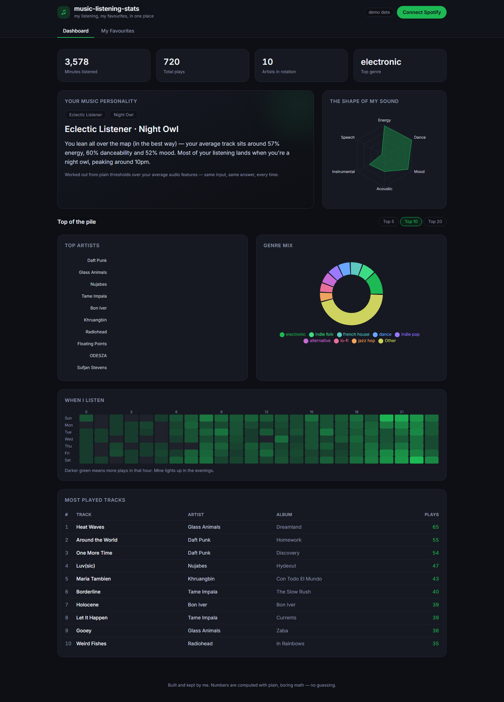
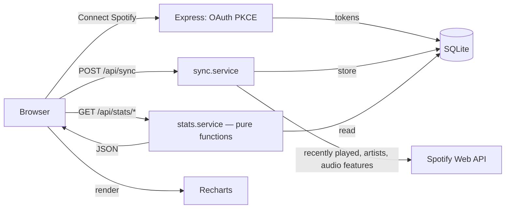

# music-listening-stats

> My music, out in the open — 77 albums I think everyone should hear at least once, the songs I'd start each of them with, a 290-track playlist of everything I'm living with this year, and the Spotify numbers behind all of it.

I got tired of my taste being scattered. Apple Music has my playlists. Spotify has my play counts. The albums I actually care about live in my head and occasionally get logged on a rating site nobody I know uses. So I built one place that holds all of it — a listening-stats dashboard on one tab and a proper favourites showcase on the other — and put the whole thing on GitHub so it's readable by anyone, even people who just want to glance at a list without running code.



---

## What's in here

**On the My Favourites tab:**
- **77 albums** — one from every era I care about, newest to oldest. Clipse at the top, Pink Floyd at the bottom, everything from Kendrick Lamar to Sade to Metallica in between.
- **77 songs** — one entry track per album, the one I'd press play on for someone hearing it for the first time.
- **My 2026 playlist** — 290 songs, the full thing, scrollable right inside the page. Also readable as a table in [PLAYLIST-2026.md](PLAYLIST-2026.md) if you'd rather not run anything.
- **Where to find me** — my Apple Music, Spotify, Album of the Year, and RateYourMusic profiles, all linked.

**On the Dashboard tab:**
- Top artists and tracks, a by-the-hour heatmap of *when* I actually listen, a genre breakdown, and an audio-feature radar (energy, danceability, mood).
- A **music personality card** — a label like *"Eclectic Listener · Night Owl"* worked out from the shape of my listening. Plain if-statements over averages, nothing more complicated than that.

The demo mode ships with a full believable dataset so you can see everything working without connecting anything.

---

## Read it without running anything

You don't need Node or a terminal to see the lists. Everything below is live on GitHub right now:

| What | Where |
| --- | --- |
| Albums, songs, profiles | [FAVORITES.md](FAVORITES.md) |
| My 2026 playlist — 290 tracks | [PLAYLIST-2026.md](PLAYLIST-2026.md) |
| Must-listen album notes | [MUST_LISTEN.md](MUST_LISTEN.md) |
| Raw data files | [data/](data/) |

The interactive bits — the charts, the scrollable tracklist, the Spotify sync — need the app running locally. One command: `npm run demo`.

---

## The bigger idea

Streaming apps are brilliant at playing music and terrible at talking about it. The places that get the conversation right are the rating communities — **[Album of the Year](https://www.albumoftheyear.org/)** and **[RateYourMusic](https://rateyourmusic.com/)** are the two I spend time on. I'm not trying to rebuild those. But it's worth explaining how they work, because this project is built on the same instinct:

- You give an album a score. Everyone else does too. The scores roll up into a **community average** shown next to a **ratings count** — because a 90 from 5,000 people means something different than a 95 from 12.
- Both sites keep **critic scores** separate from **user scores**, because they disagree more than you'd expect and the gap is always interesting.
- **Album of the Year** literally ranks records by year — filter to 2015 and you get that year's weighted leaderboard. Change the genre and the whole list reshapes.
- **Lists** are how people share taste — "my AOTY 2024", "records to cry to at 2am" — and others can like, clone, or argue with them.
- Most of it is readable without an account. You need one to rate or make lists, but you can fall down rabbit holes for free.

My version of this is smaller and more personal. I keep my picks here, in plain files, and link out to my profiles on the sites that do the community part properly. No voting, no leaderboards, no comments — just my list, in the open.

---

## My favourites

The **My Favourites** tab reads from four files you can edit by hand — no rebuild needed, just save and refresh:

| File | What's in it |
| --- | --- |
| [`data/favorite-albums.json`](data/favorite-albums.json) | 77 albums, newest to oldest |
| [`data/favorite-songs.json`](data/favorite-songs.json) | 77 songs, one per album |
| [`data/apple-music.json`](data/apple-music.json) | Playlist links + the 2026 tracklist |
| [`data/profiles.json`](data/profiles.json) | Apple Music, Spotify, AOTY, RateYourMusic, Last.fm |
| [`data/playlist-2026.json`](data/playlist-2026.json) | Full 2026 playlist — 290 tracks with artist and album |

To add your own albums, open the JSON, copy an entry, fill in the fields, save. The page updates instantly. Same for songs and playlists.

---

## Tech stack

| Layer | What I used |
| --- | --- |
| Frontend | React 18 + TypeScript, [Recharts](https://recharts.org/), [TanStack Query](https://tanstack.com/query), Tailwind CSS |
| Backend | Node + Express + TypeScript |
| Database | SQLite via Node's built-in `node:sqlite` — nothing to compile, works straight out of the box |
| Auth | Spotify OAuth 2.0 with PKCE |
| Tests | Vitest |

---

## Quick start

You need **Node 22.5 or newer**.

```bash
git clone https://github.com/omprxkash/music-listening-stats.git
cd music-listening-stats
npm install
npm run demo
```

That's it. `npm run demo` seeds a realistic listening history and starts everything. Open **http://localhost:5173**.

### Connecting your own Spotify (optional)

1. Create an app in the [Spotify Developer Dashboard](https://developer.spotify.com/dashboard) and set `http://localhost:3000/auth/callback` as the redirect URI.
2. Copy `.env.example` to `.env` and add your `SPOTIFY_CLIENT_ID` and `SPOTIFY_CLIENT_SECRET`.
3. Run `npm run dev`, hit **Connect Spotify**, approve it, then **Sync** to pull in your recently played.

```bash
cp .env.example .env
npm run dev
```

| Script | What it does |
| --- | --- |
| `npm run demo` | Seed demo data + run everything |
| `npm run dev` | Run without the demo seed |
| `npm run seed` | Reload demo data into SQLite |
| `npm run build` | Build the client |
| `npm test` | Run the test suite |

---

## How the stats work



All the maths lives in [`src/server/services/stats.service.ts`](src/server/services/stats.service.ts) — pure functions, no database calls, easy to test. The personality label is the simplest possible thing: a fixed list of thresholds checked in order (energy over 0.7 → *High-Energy Listener*, acousticness over 0.6 → *Acoustic Soul*, and so on) plus a time-of-day trait from your peak listening hour. Same input always gives the same answer.

---

## Project structure

```
music-listening-stats/
├── data/                      # the taste layer — edit these files to make it yours
│   ├── favorite-albums.json
│   ├── favorite-songs.json
│   ├── apple-music.json
│   ├── profiles.json
│   └── playlist-2026.json
├── src/
│   ├── server/
│   │   ├── index.ts
│   │   ├── db/                # node:sqlite setup, schema, demo seed
│   │   ├── routes/            # auth, stats, sync, favorites
│   │   └── services/          # spotify, token store, stats, sync
│   └── client/
│       ├── App.tsx
│       ├── components/        # Dashboard + Favourites
│       ├── hooks/
│       └── api/client.ts
├── tests/                     # Vitest — stats math + PKCE
├── FAVORITES.md
├── PLAYLIST-2026.md
├── MUST_LISTEN.md
└── README.md
```

---

## Testing

```bash
npm test
```

Two things are tested: the stats maths (heatmaps, genre shares, averages, every branch of the personality rules) and the OAuth PKCE helpers (including the worked example from RFC 7636, so I know the code challenge is right).

---

## Make it yours

Fork the repo, edit the four files in [`data/`](data/) with your albums and links, run `npm run demo`. That's the whole thing. The favourites come from the JSON, the dashboard comes from Spotify — nothing else to wire up.

To add your favourites to my copy, see [CONTRIBUTING.md](CONTRIBUTING.md) — it's a one-file edit and a pull request.

---

## Known limitations

- Spotify's recently-played endpoint only goes back ~50 tracks per call, so the history builds up as you sync rather than importing everything at once.
- Audio features are averaged across plays — if you spent a week deep in one genre, the radar will reflect that. Which is kind of the point.
- Single-user, run-it-yourself. No shared database, no public ratings — the community part lives on [AOTY](https://www.albumoftheyear.org/) and [RateYourMusic](https://rateyourmusic.com/).

---

[MIT](LICENSE) © 2025 omprxkash. Take it, fork it, make it sound like you.
